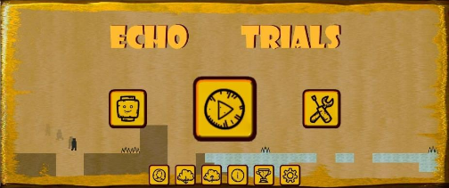

# Echo Trials on Android (Automated README)

<p align="center">
  
</p>

> **Academic source repository** — companion code for the thesis *Echo Trials on Android*: a custom 2D platformer and level-creation platform written in **pure Java** for Android, without a commercial game engine.

This repository exists so readers of the published paper can **browse the real implementation** alongside the write-up. It is a **proof-of-concept thesis project** (largely complete, but not maintained as a shippable product). Full thesis documentation, figures, and formal write-ups are published separately and are **not** included here.

A future commercial-style release is planned on a proper game engine; this codebase is archived here for **research transparency**, not for end-user distribution.

---

## What is Echo Trials?

**Echo Trials** is a landscape 2D platformer inspired by the Spanish indie game *Level Devil*, extended into a broader creative platform:

- **Challenge Trials** — curated official levels grouped into themed sections (Pits, Spikes, Push, Gravity, Movement), each teaching specific mechanics through progressive difficulty.
- **Community Trials** — browse, favourite, and share user-created levels through a cloud-backed catalogue.
- **Visual Level Creator** — grid-based editor with an advanced **trigger system** (translate, scale, fade, gravity, movement, inversion, and more) so designers can build interactive levels without writing code.
- **Custom engine** — migrated from a JavaFX desktop prototype to Android, then from CPU **Canvas** rendering to **OpenGL ES 2.0** with sprite batching, block unification, and a fixed **60 FPS** game loop.

The project was developed as an undergraduate/postgraduate thesis at the **University of Piraeus** (`com.unipi.alexandris`).

<p align="center">
  
</p>

---

## Repository purpose

| Included | Excluded (by design) |
|----------|----------------------|
| Java source (`app/src/main/java/…`) | `google-services.json` and other secrets |
| Layout & theme XML, string resources | Images, audio, fonts, mipmaps (see `.gitignore`) |
| Level definition XML in `res/raw/` | Local `documentation/` drafts and thesis chapters |
| Gradle project skeleton (structure reference) | Build outputs, IDE state, debug logs |

**You should not expect to clone and run this repo out of the box.** Firebase configuration and media assets are omitted. If you need a runnable build for study, supply your own Firebase project config and asset tree locally.

---

## Highlights (technical)

These outcomes are discussed in detail in the thesis; the codebase demonstrates how they were achieved:

| Area | Approach |
|------|----------|
| **Rendering** | OpenGL ES 2.0 — `GLGameSurfaceView`, `GLGameRenderer`, `GLSpriteBatch`, `GLTextureManager` |
| **Performance** | Block unification in `LevelLoader` (~98.5% fewer collision objects on typical levels) |
| **Game loop** | `GameLoop` + singleton `GameController` + `ObjectHandler` (entity lifecycle, physics, batched draw) |
| **Levels** | XML schema parsed by `LevelLoader` / `DataDecoder`; challenge levels ship in `res/raw/` |
| **Cloud** | Firebase Auth, Firestore, Analytics via `SessionManager` (Google Sign-In + email) |
| **Local data** | AES-256 encrypted player statistics (`EncryptionManager`) |
| **Creator** | `LevelCreatorActivity`, `LevelGridView`, trigger property dialogs, `DataEncoder` for sharing |

Reported improvements after the OpenGL migration (thesis): stable **60–120 FPS** on target devices vs. **5–15 FPS** on Canvas; dramatically faster level load; **20–100×** fewer draw calls via batching.

---

## Architecture overview

```
MainActivity
├── ChallengeTrialsActivity ──► GameHostActivity ──► GameComponent ──► GLGameSurfaceView
├── CreatorMainActivity
│   ├── CreatorMyLevelsActivity
│   ├── CreatorPublicActivity
│   └── CreatorLevelViewActivity
└── LevelCreatorActivity

GameController (singleton enum)
├── LevelLoader ──► XML / DataDecoder
├── ObjectHandler ──► model.* (Player, Block, Trigger, Portal, …)
├── PhysicsPlatformer + Camera
└── renderGL() ──► GLGameRenderer ──► GLSpriteBatch

SessionManager ──► Firebase Auth + Firestore
└── EncryptionManager ──► PlayerStatistics (local)
```

**Gameplay shell:** `GameHostActivity` hosts `GameComponent` and in-game UI (timer, stars, pause). `GameActivity` remains as an alternate fullscreen OpenGL host but is not the primary manifest entry.

---

## Source layout

All application code lives under:

`app/src/main/java/com/unipi/alexandris/android/echotrialsonandroid/`

| Package | Role |
|---------|------|
| `view` | Activities, dialogs, `GameComponent`, animated main-menu background |
| `controller` | `GameController`, `LevelLoader`, level encode/decode & compression |
| `model` | Entities: player, blocks, spikes, portals, triggers, particles |
| `data` / `data.simpleModel` | Constants, statistics, death causes, serialization DTOs |
| `utility` | Physics, camera, game loop, session, encryption, dialogs |
| `utility.opengl` | OpenGL ES rendering pipeline |
| `utility.audio` | Sound effect IDs and manager |
| `levelcreator` | Grid editor and trigger property dialogs |
| `cosmetics` | Skins, trails, death effects |
| `ai` | `ObstacleDetector` for main-menu background demo |

**~127** Java source files · **8** activities in `AndroidManifest.xml` · **23** built-in level XML files in `res/raw/`

---

## Tech stack

| | |
|---|---|
| **Language** | Java 11 |
| **Platform** | Android (API 27–34) |
| **Build** | Gradle 8.9 · Kotlin DSL · AGP 8.7.x |
| **UI** | AppCompat, Material, View Binding |
| **Graphics** | OpenGL ES 2.0 (no Unity/Godot/LibGDX) |
| **Backend** | Firebase (Auth, Firestore, Analytics) |
| **Serialization** | Gson, custom XML level format |

---

## Screenshots & media

Place repository images in a `docs/` folder (paths referenced above):

| File | Description |
|------|-------------|
| `docs/demo.gif` | Short gameplay capture *(to be added)* |
| `docs/screenshot-menu.png` | Main menu |
| `docs/screenshot-gameplay.png` | In-level view |

These paths are whitelisted in `.gitignore` so README assets can be committed without pulling in game binaries.

---

## Related publication

The formal thesis document, UML diagrams, XML schema specification, and performance analysis are **published separately** from this repository. Use this repo to **read the implementation** that those chapters refer to.

When linking this repository in a paper or citation, prefer the GitHub URL and note that it is **source-only** (no bundled media or Firebase credentials).

> **Paper / DOI link:** *(add your published reference here)*

---

## Building locally (optional)

For researchers who want to experiment on device:

1. Open the project in **Android Studio** (JDK 11).
2. Create a Firebase Android app and add your own `app/google-services.json` (not in this repo).
3. Restore excluded `res/drawable`, `res/raw` audio, and `res/mipmap` assets from your private copy if you have one.
4. Sync Gradle and run `assembleDebug`.

Dependencies are declared in `app/build.gradle.kts` (Firebase BoM, Play Services Auth, Gson, etc.).

---

## License

Source will be released under an permissive license (e.g. **MIT**) on GitHub — configure `LICENSE` in the repository settings when you publish.

---

## Acknowledgements

- Inspired by *Level Devil* (Stygian Owl).
- Developed as thesis work at the **University of Piraeus**.
- Original desktop prototype: JavaFX; this repository is the **Android** port and engine rewrite.

---

<p align="center"><i>Echo Trials — thesis proof-of-concept. Code for readers, not a product release.</i></p>

<p align="center"><i>Full Documentation (in Greek): <a href="https://dione.lib.unipi.gr/xmlui/handle/unipi/18316">Video game development with community features in an Android setting</a></i></p>
